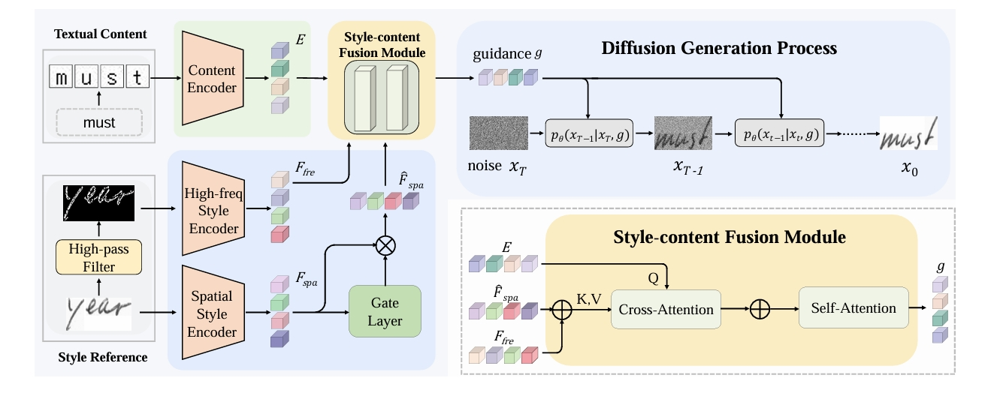
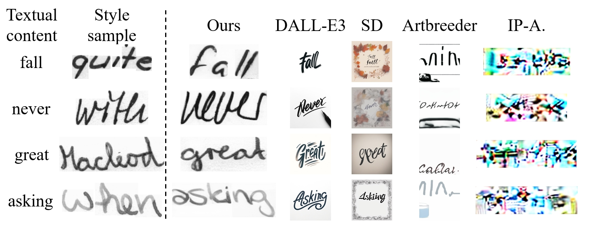
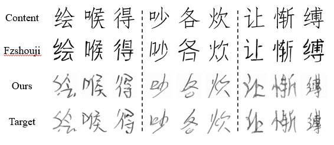
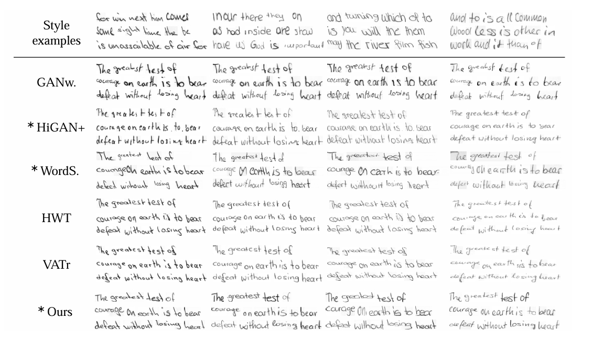
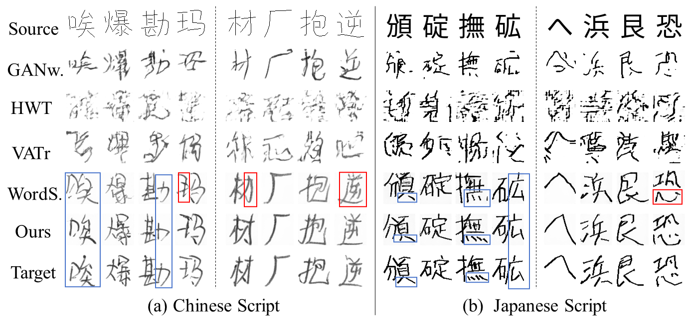

<h2 align="center"><a href="">One-DM:One-Shot Diffusion Mimicker for Handwritten Text Generation</a></h2>
<div align="center">
  <a href="https://arxiv.org/abs/2409.04004"></a>
  <a href=""></a>
  <a href="https://github.com/dailenson/One-DM/blob/main/LICENSE"></a>
</div>
<br>
<p align="center">
  
</p>
<!-- <a href="https://github.com/Ucas-HaoranWei/GOT-OCR2.0/"></a> -->

<!-- <a href="https://github.com/Ucas-HaoranWei/GOT-OCR2.0/blob/main/assets/wechat.jpg"></a> 
<a href="https://zhuanlan.zhihu.com/p/718163422"></a>  -->

<!-- [Gang Dai](https://scholar.google.com/citations?user=J4naK0MAAAAJ&hl=en), Yifan Zhang, Quhui Ke, Qiangya Guo, Lingyu Kong, Yanming Xu,  [Zheng Ge](https://joker316701882.github.io/), Liang Zhao, [Jianjian Sun](https://scholar.google.com/citations?user=MVZrGkYAAAAJ&hl=en), [Yuang Peng](https://scholar.google.com.hk/citations?user=J0ko04IAAAAJ&hl=zh-CN&oi=ao), Chunrui Han, [Xiangyu Zhang](https://scholar.google.com/citations?user=yuB-cfoAAAAJ&hl=en) -->

<!-- <p align="center">

</p> -->

## 🌟 Introduction
- We propose a One-shot Diffusion Mimicker (One-DM) for stylized handwritten text generation, which only requires a single reference sample as style input, and imitates its writing style to generate handwritten text with arbitrary content.
- Previous state-of-the-art methods struggle to accurately extract a user's handwriting style from a single sample due to their limited ability to learn styles. To address this issue, we introduce the high-frequency components of the reference sample to
 enhance the extraction of handwriting style. The proposed style-enhanced module can effectively capture the writing style patterns and suppress the interference of background noise.
- Extensive experiments on handwriting datasets in English, Chinese, and Japanese demonstrate that our approach with a single style reference even
outperforms previous methods with 15x-more references.
<div style="display: flex; flex-direction: column; align-items: center; ">

</div>
<p align="center" style="margin-bottom: 10px;">
Overview of the proposed One-DM
</p>

## 🌠 News
- [2025/06/26] 🔥🔥🔥 [DiffBrush](https://github.com/dailenson/DiffBrush), a novel state-of-the-art approach for full-line text generation, is accepted to ICCV 2025.
- [2024/10/24] We have provided a well-trained One-DM checkpoint on Google Drive and Baidu Drive :)
- [2024/09/16] This work is reported by [Synced](https://mp.weixin.qq.com/s/1JdBsjf0hru7iSS7jln02Q) (机器之心).
- [2024/09/07]🔥🔥🔥 We open-source the first version of One-DM that can generate handwritten words. (Later versions supporting Chinese and Japanese will be released soon.)


## 🔨 Requirements
```
conda create -n One-DM python=3.8 -y
conda activate One-DM
# install all dependencies
conda env create -f environment.yml
```
## ☀️ Datasets
We provide English datasets in [Google Drive](https://drive.google.com/drive/folders/108TB-z2ytAZSIEzND94dyufybjpqVyn6) | [Baidu Netdisk](https://pan.baidu.com/s/14ESFRk0RaTr98eeLzcr_xw?pwd=4vsv) | [ShiZhi AI](https://wisemodel.cn/models/SCUT-MMPR/One-DM/blob/main/English_data.zip). Please download these datasets, uzip them and move the extracted files to /data.
## 🐳 Model Zoo


| Model|Google Drive|Baidu Netdisk|ShiZhi AI|
|---------------|---------|-----------------------------------------|--------------|
|Pretrained One-DM|[Google Drive](https://drive.google.com/drive/folders/10KOQ05HeN2kaR2_OCZNl9D_Kh1p8BDaa)|[Baidu Netdisk](https://pan.baidu.com/s/1VwckEw9TN734CirfWvZgiw?pwd=pfl8)|[ShiZhi AI](https://wisemodel.cn/models/SCUT-MMPR/One-DM/blob/main/One-DM-ckpt.pt)
|Pretrained OCR model|[Google Drive](https://drive.google.com/drive/folders/10KOQ05HeN2kaR2_OCZNl9D_Kh1p8BDaa)|[Baidu Netdisk](https://pan.baidu.com/s/1VwckEw9TN734CirfWvZgiw?pwd=pfl8)|[ShiZhi AI](https://wisemodel.cn/models/SCUT-MMPR/One-DM/blob/main/vae_HTR138.pth)
|Pretrained Resnet18|[Google Drive](https://drive.google.com/drive/folders/10KOQ05HeN2kaR2_OCZNl9D_Kh1p8BDaa)|[Baidu Netdisk](https://pan.baidu.com/s/1VwckEw9TN734CirfWvZgiw?pwd=pfl8)|[ShiZhi AI](https://wisemodel.cn/models/SCUT-MMPR/One-DM/blob/main/RN18_class_10400.pth)

**Note**:
Please download these weights, and move them to /model_zoo. (If you cannot access the pre-trained VAE model available on Hugging Face, please refer to the pinned issue for guidance.)
## 🏋️ Training & Test
- **training on English dataset**
```Shell
CUDA_VISIBLE_DEVICES=0,1,2,3 torchrun --nproc_per_node=2 train.py \
    --feat_model model_zoo/RN18_class_10400.pth \
    --log English
```
- **finetune on English dataset**
```Shell
CUDA_VISIBLE_DEVICES=0,1,2,3 torchrun --nproc_per_node=4 train_finetune.py \
    --one_dm ./Saved/IAM64_scratch/English-timestamp/model/epoch-ckpt.pt \
    --ocr_model ./model_zoo/vae_HTR138.pth --log English
 ```
**Note**:
Please modify ``timestamp`` and ``epoch`` according to your own path.

- **test on English dataset**
 ```Shell
CUDA_VISIBLE_DEVICES=0,1,2,3 torchrun --nproc_per_node=4 test.py \
    --one_dm ./Saved/IAM64_finetune/English-timestamp/model/epoch-ckpt.pt \
    --generate_type oov_u --dir ./Generated/English
```
**Note**:
Please modify ``timestamp`` and ``epoch`` according to your own path.
## 📺 Exhibition
- **Comparisons with industrial image generation methods on handwritten text generation**
<p align="center">

</p>

- **Comparisons with industrial image generation methods on Chinese handwriting generation**
<p align="center">

</p>

- **English handwritten text generation**
<p align="center">

</p>
<!--  -->

- **Chinese and Japanese handwriting generation**
<p align="center">

</p>
<!--  -->


## ❤️ Citation
If you find our work inspiring or use our codebase in your research, please cite our work:
```
@inproceedings{one-dm2024,
  title={One-Shot Diffusion Mimicker for Handwritten Text Generation},
  author={Dai, Gang and Zhang, Yifan and Ke, Quhui and Guo, Qiangya and Huang, Shuangping},
  booktitle={European Conference on Computer Vision},
  year={2024}
}
```

## ⭐ StarGraph
[](https://star-history.com/#dailenson/One-DM&Timeline)
